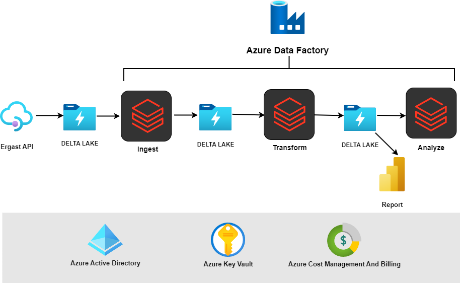

# Azure Databricks Formula 1 Project

## Project Overview

This project is focused on analyzing Formula 1 race data using Azure Databricks. The goal is to process and analyze the data using various Azure technologies, enabling efficient data handling and insights extraction.

## Project Architecture

## Dataset
The dataset includes historical Formula 1 data, such as race results, driver standings, and lap times. The data is processed to gain insights into team performance, driver comparisons, and race outcomes.

### Dataset Graph

## Technologies Used

The project leverages the following Azure services and technologies:

# Azure Databricks Formula 1 Project

## Technologies Used

- **Azure Databricks**: For big data processing and analysis.
- **Service Principal Access**: To securely authenticate and access Azure resources.
- **Azure Mount**: To mount Azure Data Lake Storage (ADLS) in Databricks for seamless data access.
- **External Tables**: For querying data stored outside of Databricks.
- **Managed Tables**: For storing and managing data within Databricks.
- **Incremental Load**: For loading data incrementally, ensuring efficient data processing.
- **Full Load**: For loading complete datasets in a single operation.
- **Delta Lake**: For handling large-scale data with ACID transactions and scalable metadata handling.
- **Azure Key Vault**: For securely storing and accessing secrets like connection strings and credentials.
- **Azure Data Factory**: For orchestrating data pipelines and automating data movement.
- **Unity Catalog**: This option (in this project) is for centralized management and governance of data and metadata across Databricks.

## Project Setup

### Prerequisites

- An active Azure subscription.
- Azure Databricks workspace.
- Azure Data Lake Storage (ADLS) account.
- Azure Key Vault for secure secret management.
- Azure Data Factory instance for data pipeline orchestration.

